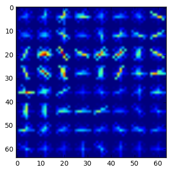

# Vehicle Detection

The Project
---
The goal of this project is to detect vehicles in an image and by extension in a video 

Described below are the different steps taken to achieve the project.

The goals / steps of this project are the following:

Histogram of Oriented Gradients (HOG)
---
###HOG extraction

* ####Parameter selection : 
I have used the [vehicle](https://s3.amazonaws.com/udacity-sdc/Vehicle_Tracking/vehicles.zip) dataset and 
the [non-vehicle](https://s3.amazonaws.com/udacity-sdc/Vehicle_Tracking/non-vehicles.zip) dataset provided as part of the project.
These example images come from a combination of the GTI vehicle image database, the KITTI vision benchmark suite, and examples extracted from the project video itself
I am using this data to train my SVM classifier for the project

* #### Image transformation :
The images in the training data and test data are in PNG format. Hence when we load the images using ``matplotlib.image`` , the image is already 
normalized. 

#####Hence we do not need to worry about normalizing the data when training the classifier. 

#### Feature extraction 
I experimented getting the features in different color channels such as RGB , HSV , YUV , YCrCB , HLS 
with different parameters. However I got the best results using the YCrCB transformation. 

After converting to YCrCB, I extract the HOG features of each image using the function 
``get_hog_features`` in ``svm_training.py`` 

After experimenting with different combinations for extracting the HOG features,I settled down 
on the following configurations. 

I am using all the 3 channels for extracting the HOG features. 

I am using 18 orientations , 8 pixel per cell and 2 cell per blocks. The main motivation factors for 
this selection is 

* Accuracy of the classifier
* Time taken to extract features( since HOG extraction is time consuming , we need to be considerate about how many 
 what configuration we pick)

```
color_space = 'YCrCb' 
orient = 18  # HOG orientations
pix_per_cell = 8  # HOG pixels per cell
cell_per_block = 2  # HOG cells per block
hog_channel = "ALL"  # Can be 0, 1, 2, or "ALL"
```

Additionally, I also tried using the spatial and the histogram features for training the classifier. 

<b>However , the performance degraded if I used any other features other than HOG features. Hence I only use HOG features for my SVM classifier</b>

Below is an example of the HOG feature for both vehicle , non - vehicle data 


<b>Example Vehicle Image</b>


<b>YCrCB transformed Vehicle image</b>


<b>YCrCB CH 0 Vehicle Feature</b>


<b>YCrCB CH 1 Vehicle Feature</b>


<b>YCrCB CH 2 Vehicle Feature</b>


<b>YCrCB CH 0 Vehicle Feature</b>


<b>YCrCB CH 1 Vehicle Feature</b>


<b>YCrCB CH 2 Vehicle Feature</b>


<b>YCrCB CH 0 HOG Vehicle features</b>


<b>YCrCB CH 1 HOG Vehicle features</b>



<b>YCrCB CH 2 HOG Vehicle features</b>


<b>Example Non-Vehicle Image</b>


<b>YCrCB transformed Non-Vehicle image</b>


<b>YCrCB CH 0 Non-Vehicle Feature</b>


<b>YCrCB CH 1 Non-Vehicle Feature</b>


<b>YCrCB CH 2 Non-Vehicle Feature</b>


<b>YCrCB CH 0 Non-Vehicle Feature</b>


<b>YCrCB CH 1 Non-Vehicle Feature</b>


<b>YCrCB CH 2 Non-Vehicle Feature</b>


<b>YCrCB CH 0 HOG Non-Vehicle features</b>


<b>YCrCB CH 1 HOG Non-Vehicle features</b>


<b>YCrCB CH 2 HOG Non-Vehicle features</b>

There are more images in the output directory and also there in `vehicle-car-detection.ipynb`. 

#### Classifier

We create a horizontal feature vector of length 10584 for every image in our training and test data set which are of 
size 64x64 . We have around 8k car image samples and around 9k non-car image samples.
We use this data set to train our SVM classifier. 
We break the dataset randomly into training and test dataset by using 20% for testing and rest for training. 

```
rand_state = np.random.randint(0, 100)
X_train, X_test, y_train, y_test = train_test_split(scaled_X, y, test_size=0.2, random_state=rand_state)
```

The `trainsvm()` in `svm_training.py` trains the svm for us.
We store the svm and the scalar variables in a pkl file so we can use it later on.

Here is the output of training the svm classifier: 

```
Loading car files
Loaded car files
Loading non-car files
Loaded  8792  cars
Loaded  9666  non cars
Extracting car features
Extracting non-car features
Using: 18 orientations 8 pixels per cell and 2 cells per block
Feature vector length: 10584
9.55 Seconds to train SVC...
Test Accuracy of SVC =  0.9859

```

##Vehicle detection pipeline

####Sliding window implementation

To detect car in our image, we use a sliding window technique. 

We will first describe the data structures that will be helpful to us

######DataStructures 

```
class ImageHolder:
    def __init__(self):
        self.previousHeat = [] ## List of heatmaps in the previous images 
        self.labels = [] ## Locations of previously detected cars
        self.iteration = 0 ## Current image being processed
        self.averageCount = 10 ## The number of historical data we want to retain

```

 
* We pass the image into a function `gethotwindows` that is tasked with detecting vehicles in the image.

Since HOG is a computationally expensive operation, I have tried to optimize the sliding window operation.

1) We run the classifier only on the lower half of the image where the road lies

`y_start_stop = [int(image.shape[0]/2), image.shape[0]] `

2) For the X co-ordinate ranges, we decide the limits of the X co-ordinates using historical information 
about the image. 

3) Every time we find cars, we store this information in the imageHolder. 

4) We use the min and max of the X coordinate of the last seen cars in our previous car label 

5) This information helps us minimize the X ranges over which we search. 

6) Every alternate iteration, we scan the entire range of X axis. This helps us prevent losing detection if 
 a new car appears in the image 

7) We use a window size of 75x75 for the upper half of the image being searched with an overlap of 80%.
`  windows = slide_window(image, x_start_stop=x_start_stop, y_start_stop=[int(image.shape[0]/2)+25,int(image.shape[0]/2+100)],
                             xy_window=(75, 75), xy_overlap=(0.8, 0.8),window_list=None)`
                             
8) We use a window size of 100x100 for the lower half of the image being searched 
`slide_window(image, x_start_stop=x_start_stop, y_start_stop=[int(image.shape[0]/2+75), image.shape[0]],
                            xy_window=(100, 100), xy_overlap=(0.8, 0.8),window_list=windows)
`                      
9) Using 80% overlap with these different sizes gives us a good dataset to search for the cars in these images 
                    
10) These images are passed onto the next stage where the image is resized to 64x64, extract HOG features and then fed into the classifier
 
11) If the classifier detects a car in the window, we add that window to the list of hot_windows

12) This list of hot windows is then superimposed onto the incoming image that gives us a list of potential detections


######Thresholding and removal of false positives

As shown in the intermediate output, we get a lot of overlaps of detections along with some false positives. 

This section describes how we deal with thresholding as well as removal of false positives

1) Using this intermediate output, we create a heatmap of the detections 

```
def add_heat(heatmap, bbox_list):
    # Iterate through list of bboxes
    for box in bbox_list:
        # Add += 1 for all pixels inside each bbox
        # Assuming each "box" takes the form ((x1, y1), (x2, y2))
        heatmap[box[0][1]:box[1][1], box[0][0]:box[1][0]] += 1

    # Return updated heatmap
    return heatmap

```

2) We maintain a moving list of the last 10 heatmap images. We update this moving list of heatmap with the latest heatmap   

3) For the final output heatmap, we average out the last 10 heatmaps. This helps us reduce false positives. 
 ie . If our classifier detects a vehicle in 1 image but not in any other,then this value will be 
 averaged out in our final output. 
 
4) We then threshold the heatmap to allow output where there has been an overap of at least 2. 
This helps us to maintain strong detection only and any weak detections will be weeded out.

```
 holder.previousHeat[holder.iteration%holder.averageCount] = heatmap
    total = np.zeros(np.array(holder.previousHeat[0]).shape)
    
    for value in holder.previousHeat:
        total = total + np.array(value)
    
    averageHeatMap = total/holder.averageCount
    
    averageHeatMap = apply_threshold(averageHeatMap,2)

```
5) This averaging makes our output smoother as well as helps remove false positives


5) We then draw boxes around the final detected heatmap. 
   
6) If we find any detections with width or height < 10, we discard those detections. 

``` 
if abs(np.min(nonzerox)-np.max(nonzerox)) > 10 and abs(np.min(nonzeroy)-np.max(nonzeroy)) > 10:
    filterd_boxes.append([np.min(nonzerox), np.min(nonzeroy),np.max(nonzerox), np.max(nonzeroy)])            
```
7) We will also find overlapping rectangles in this case. We try to minimize such detection by detecting and merging 
overlapping rectangles

```
for i in filterd_boxes:
        final_value = i 
        for j in filterd_boxes:
            if i !=j and overlapping(i,j):
                final_value = [min(final_value[0],j[0]),
                               min(final_value[1],j[1]),
                               max(final_value[2],j[2]),
                               max(final_value[3],j[3])]
        cv2.rectangle(img,(final_value[0],final_value[1]),(final_value[2],final_value[3]), (0,0,255), 6)        
```

8) This is the final output 


###Output Video

<a href="output.mp4">Output Video</a>

The output video of the project video is stored as output.mp4


Discussion 
---
#####Shortcomings
1) As seen in the output video, the object detection is good but still not good enough
2) There are places where the white car is not detected for several seconds 
3) Also it is not an easy task to detect whether there is 1 car or 2 cars when the cars are 
 overlapping in the video
4) HOG is a very computationally expensive operation. It took me around 2 hours to compute a 50 second video
5) Intelligently detecting windows to run the HOG on can help improve performance but it is not fail safe.
6) If we are to use this in real time, we need to run more than 20-30 frames a second.
7) HOG will not lead us to this performance. In my opinion, we should use deep learning to detect vehicles as well as other objects 
simultanesouly in the image. 

#####Future work
1) As suggested above, I would like to implement this pipeline using a deep learning based classifier. 
2) Instead of using a sliding window, it would be great if we can simply pass in the entire image as input and 
detect the locations of the vehicle masked onto the image as output . 
3) This is a classification + regression problem that has been successfully solved in systems like YOLO. 
4) I would like to use that as an inspiration to solve this project again and optimize the performance of vehicle detection.


